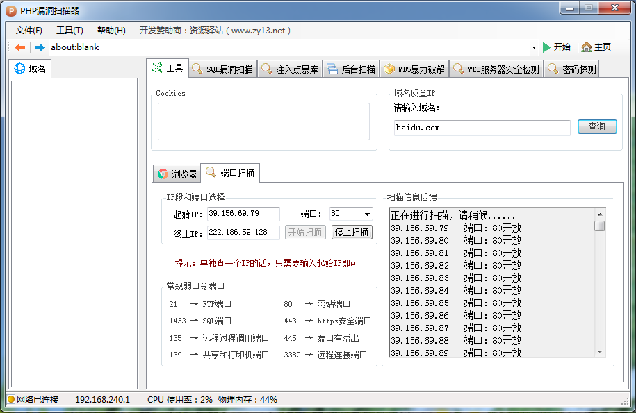

# PHP漏洞扫描器
### 开发语言：C#
### 开发工具：Microsoft Visual Studio 2010
## 软件简述：
PHP漏洞扫描器（PHP Vulnerability Scanner，PVS）是用于监测网站漏洞的安全扫描工具，为企业和小资站长提供准确、全面的漏洞监测服务，从而避免漏洞被黑客利用，影响网站资产安全。目前漏洞扫描工具已广泛应用于金融、通信、政府、能源、军工等多个行业，并已被多个行业监管机构和等级保护单位使用。
## 软件功能：
1. 扫描注入点；
2. SQL漏洞扫描；
3. 注入点暴库；
4. 后台扫描；
5. MD5暴力破解；
6. WEB服务器安全检测；
7. 密码探测；
## 软件截图：
